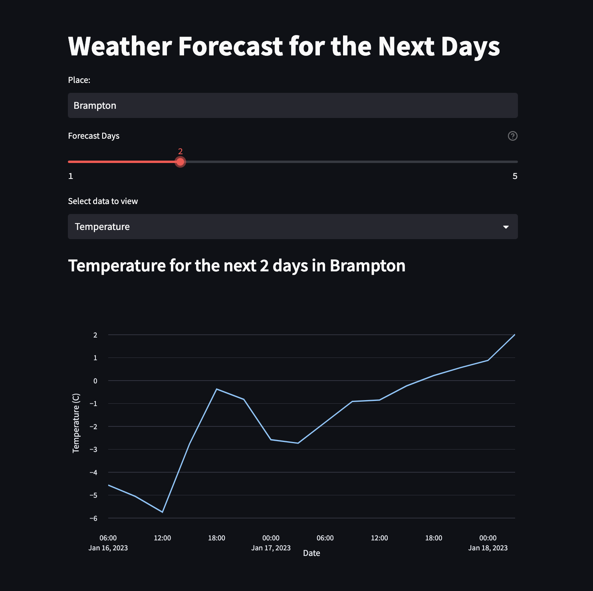
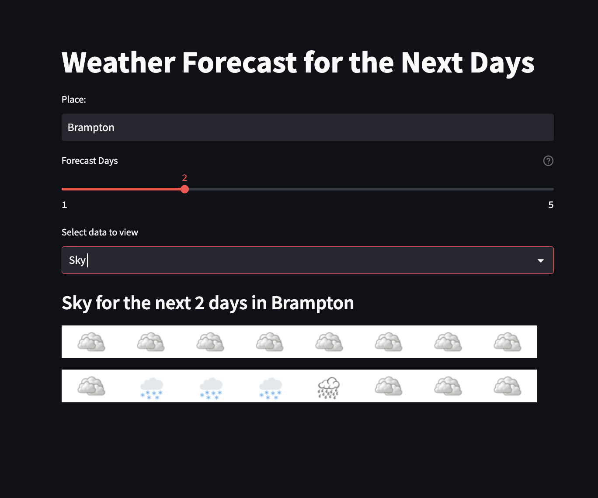

# Weather Forecast Web App

 

## <u>Table of Contents</u>

1. [Description](#Description)
2. [Usage](#Usage)
3. [Contributing](#Contributing)
4. [Authors](#Authors)
5. [License](#License)

## Description

Introducing the ultimate weather dashboard! Stay informed and plan ahead with our 5-day forecast feature. Our
user-friendly interface allows you
to switch between a temperature graph and easy-to-read sky condition icons, so you can choose the way you prefer to
check the weather. Never be caught off guard by the weather again with our comprehensive and customizable weather
dashboard.

### Dependencies

This application uses a number of packages to achieve its core functionality.

```commandline
streamlit
```

Streamlit is used to build the web client side interface. The application is also deployed via the streamlit platform.

```commandline
plotly
```

The express module from the plotly package is used to create the figure object using the data fetched from the
openweathermap api. This object is then used by streamlit to display the scatter plot graph which shows the temperatures
of the desired city.

```commandline
dotenv and os
```

The dotenv and os packages are used in conjunction to protect and access the API key necessary for the openweathermap
api.

```commandline
requests
```

The requests package is used to create a fetch request to the openweathermap api to access the weather data for the
desired city inputted by the user.

```
openweathermap api
```

The openweathermap api was used to fetch temperature and sky condition data.

## Usage

To use this application, visit the application URL
at https://charanvir-weather-forecast-web-app-main-c2znod.streamlit.app/

Enter the name of city, the number of days to forecast, and whether you want to view the temperature of sky conditions.




## Contributing

We are always looking to improve your application and code, so if you wish to contribute, please create a repository and
push all changes you make to it. Then email me at charanvir123@gmail.com, and I will try to get back to you after I have
reviewed the code.

## Authors

To view more projects visit my [GitHub](https://github.com/Charanvir) account.

Direct any additional questions you have regarding this application to charanvir123@gmail.com

# License

The following application is covered under the MIT License.